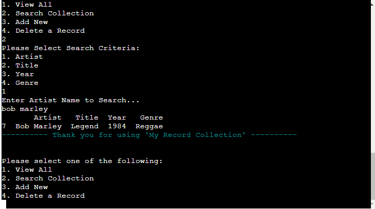
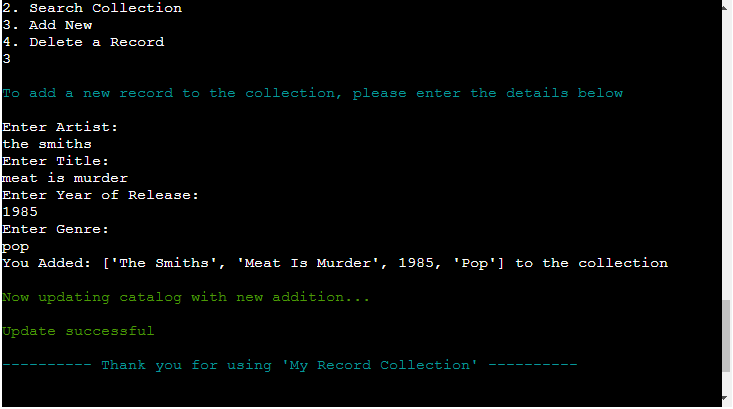
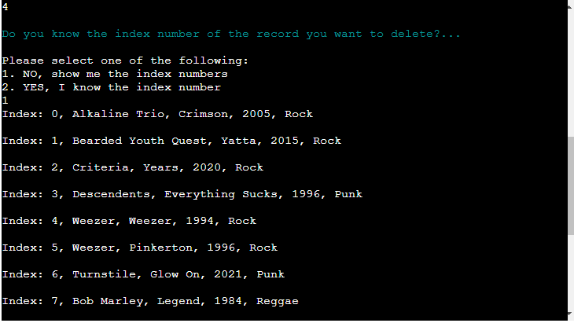
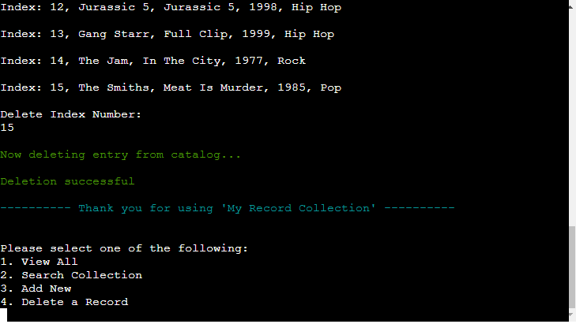
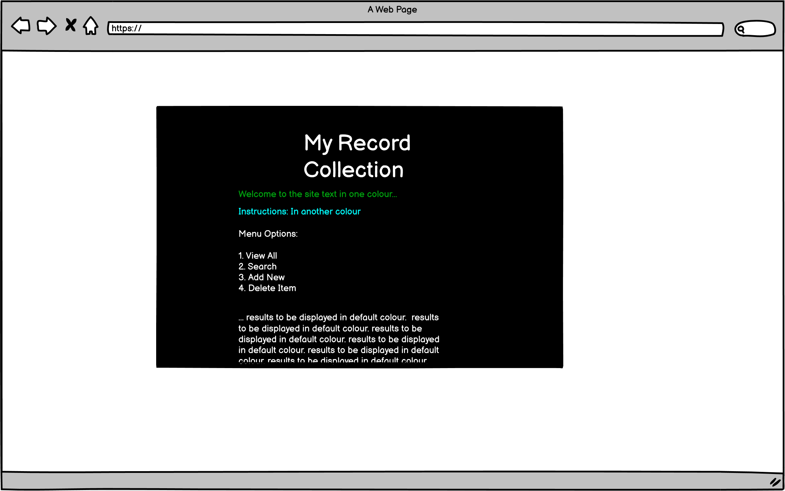
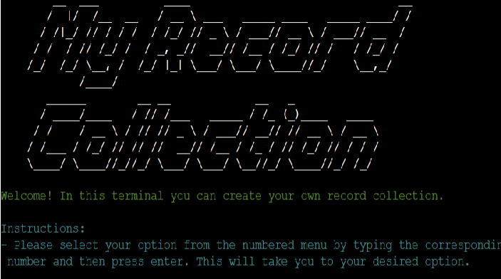
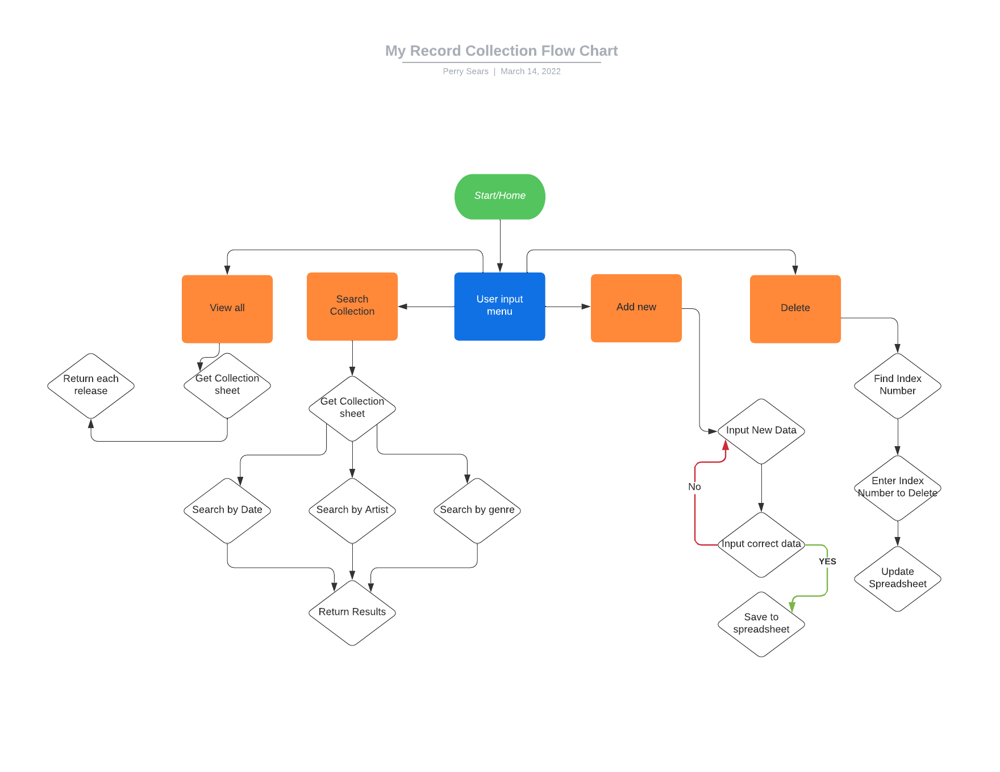
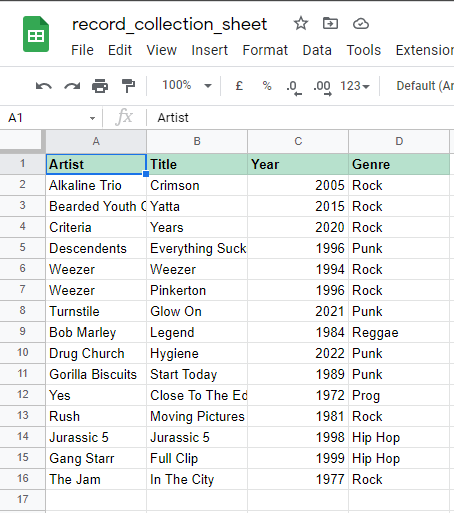

# My Record Collection
## About
**My Record Collection** is a terminal based record collection catalog tool that the user can interact with via inputs. They can view the entire catalog, search for their specific records, add new records and delete them. All data is saved and updated to a spreadsheet and accessed via the Google Sheets gpread API.

The inspiration for this project comes from the many times I have spent looking through my record collection at home and wanting to document certain info about releases to save me pysically digging through to check such information like the date of release for a certain record.

## Contents
  - [About](#about)
  - [Contents](#contents)
  - [Features](#features)
  - [User Experience](#user-experience)
  - [Design](#design)
  - [Data](#data)
  - [Testing](#testing)
  - [Input Validation Notes & Example Function](#input-validation-notes--example-function)
  - [Bugs](#bugs)
  - [Future Improvements](#future-improvements)
  - [Technologies](#technologies)
  - [Deployment](#deployment)
  - [Credits](#credits)

## Features
### Greeting & User Input Menu
When the terminal is fully loaded and ready to use, the user is greeted with the My Record Collection logo at the top of the terminal. Below the logo is a green welcome message and cyan instruction.

The user can select from four options using the input menu by either entering the number of their desired choice, or by entering option name.

### View All
The View All option displays the full catalog of records in artist-alphabetical order. The catalog is displayed in a DataFrame format. When compared to a standard dictionary format, the DataFrame is visually easier to read from a user perspective.

### Search Collection
The Search Collection option allows the user to browse the record collection via search criteria. After the user enters the Search Collection option from the main menu, they are presented with another input menu displaying the search criteria option. The user can enter one option from a choice of: Artist, Title, Year of Release, and Genre. Once the choice is enetered the user is asked to enter the details of what they would like to search for.
The results are then displayed in the terminal.

### Add New
The Add New option allows the user to add a new title to the collection. They are asked to enter required information starting with the Artist name, then the Title name, Year of Release, and finally the Genre. Once the information is entered correctly a string showing what the user has added is displayed and the catalog spreadsheet is updated.

### Delete a Record
The final option from the main menu is Delete a Record. This allows the user to delete items via index numbers.
The user is asked if they know the index number of the record they wish to delete, and is presented with two options. Option one shows the collection in rows starting with and Index column.
At the end of the indexed collection is the input for the required index number for the user to enter.
Option two displays the input only.

Once the user has entered the index number of the record they wish to delete, the record is then deleted from the spreadsheet and updated.

## User Experience

### User Goals
* I want a straight forward, intuitive system to input and display information.
* I want to navigate menu options quickly.
* I want the data I input or delete to be saved to a spreadsheet.

### User Stories
* First Time User
    * As a first time user, I want to know what the purpose of the app is.
    * As a first time user, I want clear instructions of how to navigate and use the app.
    * As a first time user, I want a menu system that is intuitive.
    * As a first time user, I want to view the record collection in an easy to read format.
    * As a first time user, I want to add new records with ease.
    * As a first time user, I want my new additions saved.
* Returning User
    * As a returning user, I want to be able to access the main menu without restarting the app.
    * As a returning user, I want the spreadsheet updated after each deletion or addition.
    * As a returning user, I want colored text to define prompts and data.
* Owner Goals
    * As the owner, I want the terminal to be easy to use.
    * As the owner, I want the menu to be reliable.
    * As the owner, I want the terminal to be attractive.
    * As the owner, I want users to return.
    * As the owner, I want the spreadsheet updated after each edit.

## Design
### Wireframes
I used Balsamiq to design a simple wireframe to help determine design limitations. 

My aim was to produce an attractive terminal with with a simple use of colors for text.

### Logo and Colors

I wanted to create a logo so that the user knows when the terminal has first loaded and creates a welcoming introduction to the app. I simply used the My Record Collection title and generated an ACSII terminal logo using the website http://patorjk.com/software/taag/

I wanted to accentuate the difference between data and processes. To achieve this I chose to use the colors green and cyan for instructions and messages, and kept the menu and data text white to contrast the black terminal.

## Data
### Flow Chart
It was important for me to plan the way the options should function in order to work with the input data I wanted to save. I made a flow chart displaying the neccessary steps needed which helped scope the usability. Flow chart created using http://lucidchart.com/

### Spreadsheet
The record collection data is stored in a single worksheet using Google Sheets. This is accesed via the gspread API and updates when the user either adds to the collection or deletes an existing entry. The data is saved in named column as shown below.

### DataFrame
I chose to display the record collection as a DataFrame. When the full collection was displayed as a list or dictionary it looked a little messy, so I searched for potential solutions. Results led me to use the Pandas library to convert the sheet data into a DataFrame which displays the data in the terminal as columns and rows. 

## Testing
### PEP8
All python files tested to PEP8 requirements.

### Testing User Goals
* I want a straight forward, intuitive system to input and display information.
    * The instructions are clear and requested data is displayed in a well formatted way.
* I want to navigate menu options quickly.
    * The menus are easy to use. Validation allows only correct input data to be entered. 
    * The main menu is displayed at the bottom of the terminal with a "Thank You" message after a process is complete, and allows continued use of the app.
* I want the data I input or delete to be saved to a spreadsheet.
    * All new addition data and deleted records are saved onto a Google Sheets document which is accessed with the gspread API.

### Testing Functionality
The Gitpod terminal was used to test all of my functions during the progress of this project. If errors occured I could debug and correct errors posted in the terminal. Once basic funtionality was working I deployed the project to Heroku which gave me an end user test environment.

## Input Validation Notes & Example Function
I want to draw attention to my use of Pyinputplus as my chosen means for input validation. This project called for multiple choice menus within multiple choice menus which would require many lines of code to test for validation errors, for instance using try and except statements. Through a search I found that pyinputplus does all of this in a neat package. 

I have included an example function called `def user_choice_example():` which demonstates another form of validation for assessment purposes.  

## Bugs
* Wrong row being deleted in Google Sheets.
    * The correct index was deleted in DataFrame but not in Sheets. Solution was to add 2 to the `index_to_delete` variable which added 2 onto the row numbers in the Google Sheets doc.
* ACSII Art was too large for Heroku terminal.
    * Solution was to simply change the design on the ACSII generator website to fit to the terminal.
* View All did not display in an easy to read format.
    * Solution was to install the Pandas library and convert the spreadsheet into a DataFrame `pd.DataFrame(CATALOG_SPREADSHEET.get_all_records())`
* `update_worksheet(user_data)` function was being called after every other function.
    * Solution was to remove the `update_worksheet` function call and add `(user_data: list):` to `update_worksheet()` function. I then renamed both functions to improve readability.
* Heroku stopped loading.
    * This happened after I installed the Pandas library. The solution wast to add the pandas requirements to the requirements.txt file.

## Future Improvements
Key features that I would like to add once the spreadsheet is more densely populated include:
* `get_all_catalog_records()` This can be improved by caching the result of the function for 'x' amount of seconds/minutes.
* Moving the data into new worksheets in Genre order
* Add a "Sold" option to the Delete a Record option.
    * Create a Sold worksheet and sum the total of all sold items

## Technologies
### Technologies
* Python is the main technology used in creating all the functionality of this tool using some libraries to expand it's capabilities.
* HTML and Javascript are used simply to house and launch the terminal and these files were created in the template used for the repo.
* Gitpod was used as my develepment environment.
### API
* GSpread is used in order to receive and manipulate data found in the Google Sheets spreadsheets.
* Google OAuth is required in order to use the Google API's to access the spreadsheets.
### Libraries
* [PyInputPlus](https://pypi.org/project/PyInputPlus/) 
    * PyInputPlus was used as my choice for input validation. 
* [Pandas](https://pandas.pydata.org/)
    * Pandas was used to display the data in the terminal as a DataFrame. 

* [TermColor](https://pypi.org/project/termcolor/)
    * TermColor was used to add color to text in the terminal

## Deployment

This project is deployed to Heroku which is where it is available to view publicly. The project was developed using Gitpod with Github serving as host for my respository. 
### Heroku Deployment Procedure
1) Create an account with Heroku.
2) Create a new project and give it a name. 
3) Navigate to the settings page for your project and go to the config vars section
* Here your must create 2 config vars
    * Key = PORT Value = 8000
    * Key = CREDS Value = Copy and paste the contents of creds.json
    
Below config vars in the add buildpacks section you must add the "Python" and "Node.js" buildpacks in that order. In your IDE confirm requirements.txt is up to date you using pip freeze > requirements.txt in the teminal.
Push all changes to your github repository.
Back in Heroku navigate to the deploy page and link your GitHub account.
Select the branch of your project to deploy click deploy branch Your project will deploy in a few moments and you will have a button to open your app.

## Credits
### Coding Support & Advice
* Thank you to my Code Institute mentor Reuben Ferrante for his guidence & Advice.
* YouTube Tutorials
    * I found out about the PyInputPlus library through this youtube video: https://www.youtube.com/watch?v=2201B0vGwx8
    * I found out about Pandas through this youtube video: https://www.youtube.com/watch?v=F-gDgQ6kuuk&t=415s
* Code Intitute Python essetials course material & Love Sandwiches Walkthrough

### Tools 
* ACSII Art genereated from: http://patorjk.com/software/taag/

