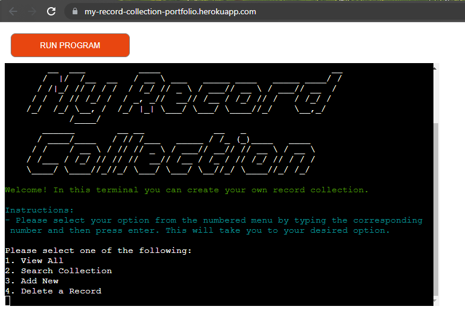

# My Record Collection
## About
**My Record Collection** is a terminal based record collection catalog tool that the user can interact with via inputs. They can view the entire catalog, search for their specific records, add new records and delete them. All data is saved and updated to a spreadsheet and accessed via the Google Sheets gpread API.

The inspiration for this project comes from the many times I have spent looking through my record collection at home and wanting to document certain info about releases to save me pysically digging through to check such information like the date of release for a certain record.

View deployed site on this link: https://my-record-collection-portfolio.herokuapp.com/

## Features
### Greeting & User Input Menu
When the terminal is fully loaded and ready to use, the user is greeted with the My Record Collection logo at the top of the terminal. Below the logo is a green welcome message and cyan instruction.

The user can select from four options using the input menu by either entering the number of their desired choice, or by entering option name.

### View All

